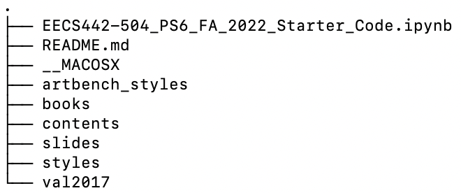

# EECS 351 Final Project: GAN Style Transfer

## Credits:
EECS 504, Homework starter code

Paper by Leon A. Gatys, Alexander S. Ecker, Matthias Bethge

Title: A Neural Algorithm of Artistic Style, Link: https://arxiv.org/abs/1508.06576

Code Modified by: Jason Ning

## Overview:
The group was provided a starter code from EECS 504 (University of Michigan) and was 
tasked to implement 3 important functions: the Gram Matrix, Style loss, and Content loss.

The goal of the project is to apply the DSP tools that we learned in class,
such as convolution, and matrix multiplication, to achieve style transfer between the 10 categories of artwork
in the ArtBench-10 database.

## Dependencies:
1. pytorch (version 2.0 or up)
2. Anaconda/Jupyter Notebook

## How to Use:
1. `$ git clone https://github.com/ziyang-ning/GAN_Style_Transfer.git `
2. Open the ipynb file called **EECS442-504_PS6_FA_2022_Starter_Code**
3. Run the code blocks, it should install a content and style folder
if everything works, you should see **Style images exist you have the artbench styles, ready for 351 demo!**

## Over All file structure:
You might not have folders such as Slides, since you don't need these information

